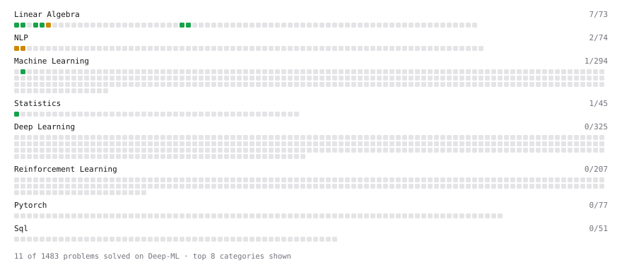

# Deep-ML

My machine learning practice from [Deep-ML](https://www.deep-ml.com). Every solution here was written by hand.

**3** solved · 3 problems · 0 labs · 0 math

[**Browse the interactive portfolio**](https://Subrahmanyam2305.github.io/deep-ml/) to replay this filling in over time.

## Problems

| | Difficulty | Solved | |
| --- | --- | --- | --- |
| [Calculate Covariance Matrix](https://www.deep-ml.com/problems/10) | easy | 2025-04-02 | [solution](problems/0010-calculate-covariance-matrix) |
| [Implement TF-IDF (Term Frequency-Inverse Document Frequency)](https://www.deep-ml.com/problems/60) | medium | 2025-03-23 | [solution](problems/0060-implement-tf-idf-term-frequency-inverse-document-frequency) |
| [Optimal String Alignment Distance](https://www.deep-ml.com/problems/51) | medium | 2025-03-25 | [solution](problems/0051-optimal-string-alignment-distance) |

---

_This file is regenerated by Deep-ML on every push._
